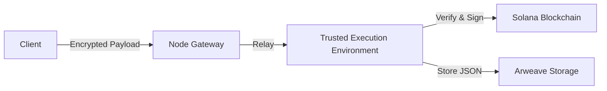

# Title Protocol

**The Identity Layer for Digital Content**

Title Protocol is a decentralized infrastructure that provides **Attribution** for digital content. By combining with **C2PA** (Coalition for Content Provenance and Authenticity), it grants digital content a complete, verifiable identity.

## 0. The Missing Piece in Digital Identity

For digital content to have a true "Identity," three conditions must be met:

1. **Provenance:** The origin and creation process are cryptographically verifiable.
2. **Integrity:** It is possible to detect if the content has been tampered with.
3. **Attribution:** The rights ownership can be resolved trustlessly.

**C2PA** solves Provenance and Integrity. **Title Protocol** solves Attribution.

### The Web Infrastructure Analogy

The relationship between C2PA and Title Protocol is analogous to the infrastructure that secures the Web:

| Role | Web Infrastructure (TLS/DNS) | Digital Content (C2PA/Title) |
| --- | --- | --- |
| **Certificate** | **SSL/TLS Certificate**<br>

<br>Proves the server is who it claims to be. | **C2PA Manifest**<br>

<br>Proves the content's origin and integrity. |
| **Audit Log** | **Certificate Transparency (CT) Logs**<br>

<br>Publicly records issuance to prevent fraud. | **Title Protocol (Core)**<br>

<br>Records TEE-verified facts to a blockchain ledger. |
| **Resolution** | **DNS**<br>

<br>Resolves a domain name to an IP address. | **Title Protocol (Resolve)**<br>

<br>Resolves a content ID to a Wallet Address. |

Just as the Web relies on DNS and CT Logs, digital content requires an infrastructure to resolve rights and audit existence. Title Protocol is that infrastructure.

## 1. Design Principles

Title Protocol is designed as a neutral, permissionless public utility.

* **Content-Agnostic & Neutral:**
The protocol operates as neutral infrastructure, much like TCP/IP. It acts as a **registry, not a regulator**. It does not judge, filter, or censor content based on its nature. If the cryptographic proofs are valid, the protocol records the attribution without bias.
* **Stateless:**
The protocol runs inside **TEEs (Trusted Execution Environments)**. These nodes hold no state between requests; they simply accept input, perform computation, and return a result.
* **Permissionless:**
Anyone can build applications on top of the protocol. Node operation is managed by a DAO, preventing dependence on any single centralized entity.
* **Privacy-First (E2EE):**
Data sent to the protocol is End-to-End Encrypted. Even the node operator cannot view the raw content, ensuring privacy and minimizing liability for operators.

## 2. Protocol Architecture

The protocol consists of two distinct layers that share a common registration and verification flow.

### Layer 1: Core (The Provenance Graph)

The Core layer establishes the **Rights Structure** of the content.

* **Input:** C2PA-signed content.
* **Process:** The TEE verifies the C2PA signature chain and recursively extracts "ingredient" data (assets used to create the content).
* **Output:** A **Provenance DAG (Directed Acyclic Graph)** recorded as a **Solana cNFT**.
* **Function:** It answers the question: *"Who is involved in this content?"* (e.g., identifying the wallet addresses of the creator and all ingredient owners for revenue distribution).

### Layer 2: Extension (The Attribute Layer)

The Extension layer attaches **Objective Attributes** to the content.

* **Input:** Content + Optional auxiliary inputs (e.g., ZK proofs).
* **Process:** The TEE executes deterministic **WASM modules**.
* **Output:** Key-Value attributes recorded as a **Solana cNFT**.
* **Function:** It answers the question: *"What are the properties of this content?"*
* *Example:* `phash-v1` calculates a perceptual hash for similarity search.
* *Example:* `ai-training-v1` extracts "Do Not Train" flags from metadata.
* *Example:* `hardware-proof` verifies if the content was captured by specific hardware (e.g., Sony, Canon, Google Pixel).


## 3. How It Works (Node Perspective)

The registration process is designed to be secure, scalable, and operator-friendly.



1. **Encryption:** The client encrypts the content and the destination wallet address using the TEE's public key (E2EE).
2. **Blind Processing:** The Node Operator (Gateway) relays the encrypted payload to the TEE. The operator **cannot** see the content or the wallet address.
3. **Verification:** The TEE decrypts the payload in a secure enclave, verifies the C2PA signatures, and executes WASM modules.
4. **Signing:** The TEE signs the result with its private key.
5. **Minting:** The result is stored on Arweave, and a **Compressed NFT (cNFT)** is minted on Solana, linking the content hash to the user's wallet.

## 4. Operational Model

### Registry, Not Police

Title Protocol serves as a "Deed Office." It records objective facts (who claimed this content at what time with what proof). It does not police the content. Logic for filtering illegal content or handling disputes belongs to the **Application Layer**, not the Protocol Layer.

### Trusted Execution Environments (TEE)

Nodes must run on hardware that supports Remote Attestation (e.g., AWS Nitro Enclaves). This guarantees to the network that the node is running the exact, unmodified open-source code of the protocol, ensuring that the verification results are trustworthy without needing to trust the node operator.

### Scalability via Solana cNFTs

By utilizing Solana's Compressed NFTs (Bubblegum), the protocol can handle millions of registrations at a fraction of the cost of traditional NFTs, making it viable for high-volume content ecosystems like social media or AI generation.

## 5. Technical Stack

* **Core Logic:** Rust
* **Runtime:** AWS Nitro Enclaves (TEE)
* **Blockchain:** Solana (Compressed NFTs)
* **Storage:** Arweave (via Irys)
* **Standards:** C2PA (Coalition for Content Provenance and Authenticity)

---

## Quick Start

```bash
# Build and test the Rust workspace
cargo check --workspace
cargo test --workspace

# Build WASM modules
for dir in wasm/*/; do
  cargo build --manifest-path "${dir}Cargo.toml" --target wasm32-unknown-unknown --release
done

# Build TypeScript SDK & Indexer
cd sdk/ts && npm ci && npm run build && cd ../..
cd indexer && npm ci && npm run build && cd ..
```

## Repository Structure

```
crates/
  types/          — Shared type definitions (§5)
  crypto/         — Cryptographic primitives: ECDH, HKDF, AES-GCM, Ed25519 (§6.4)
  core/           — C2PA verification & provenance graph construction (§2)
  wasm-host/      — WASM execution engine using wasmtime (§7.1)
  tee/            — TEE server: /verify, /sign, /create-tree (§6.4)
  gateway/        — Gateway HTTP server: upload-url, relay, sign-and-mint (§6.2)
  proxy/          — vsock HTTP proxy for TEE network isolation (§6.4)
wasm/             — WASM modules: phash-v1, hardware-google, c2pa-training-v1, c2pa-license-v1
programs/
  title-config/   — Anchor Solana program for Global Config PDA (§8)
sdk/ts/           — TypeScript client SDK: register, crypto (E2EE), storage
indexer/           — TypeScript cNFT indexer: webhook, poller, DAS API
prototype/        — Reference implementations (read-only)
docs/                — Versioned development docs (SPECS → COVERAGE → tasks per version)
  v1/              — Initial implementation (2026-02-21, complete)
    SPECS_JA.md    — Technical specification (Japanese, ver.9)
    COVERAGE.md    — Spec-to-implementation coverage (cumulative)
    tasks/         — AI-driven development tasks (01–13) + work notes
```

## Running a Node (Local Development)

```bash
# 1. Start infrastructure services
docker compose up -d

# 2. Initialize local environment (MinIO bucket, Solana config, etc.)
bash scripts/setup-local.sh

# 3. Run E2E tests
cd tests/e2e && npm install && npx tsc && node --test dist/e2e.test.js
```

See `.env.example` for all available configuration options.

## Deploying to Devnet

### Prerequisites

- EC2 instance (c5.xlarge recommended) with Docker & Docker Compose
- Solana CLI configured for devnet
- Anchor program deployed: `anchor deploy --provider.cluster devnet`
- `.env` configured (copy from `.env.example`)

### Steps

```bash
# 1. Load environment variables
source .env

# 2. Configure Solana CLI
solana config set --url "$SOLANA_RPC_URL"
solana config set --keypair ~/.config/solana/id.json

# 3. Build & start services (use docker-compose.yml for mock TEE)
docker compose build
docker compose up -d

# 4. Initialize Global Config & create Merkle Tree
#    This script will:
#    - Initialize the on-chain Global Config PDA
#    - Register TEE node information
#    - Fund the TEE internal wallet
#    - Call /create-tree and broadcast the transaction
node scripts/init-config.mjs --rpc "$SOLANA_RPC_URL"
```

### Important Notes

- **TEE is stateless**: Keys are regenerated on every restart. After restarting `tee-mock`, re-run `init-config.mjs` to create a new Merkle Tree.
- **`/create-tree` is one-shot**: Each TEE instance only allows one `/create-tree` call per lifecycle.
- **Port conflicts**: Ensure ports 3000 (Gateway), 4000 (TEE), 5000 (Indexer) are free before starting.
- **SOL funding**: The TEE internal wallet needs SOL for tree creation rent (~0.5 SOL for depth-14 tree).
- For production (Nitro Enclave), use `deploy/aws/docker-compose.production.yml` instead.
- See `docs/v1/tasks/17-devnet-deploy/README.md` for detailed operational notes.

## For Developers

This project uses an AI-driven development workflow:

- **`CLAUDE.md`** — Instructions for AI coding assistants (project conventions, architecture)
- **`docs/`** — Versioned documentation: each version contains SPECS (what to build) → COVERAGE (what's built) → tasks (how to build it + notes)
- **`docs/v1/`** — Initial implementation phase (2026-02-21, all 13 tasks complete)

## License

This project is open-source infrastructure. See LICENSE for details.