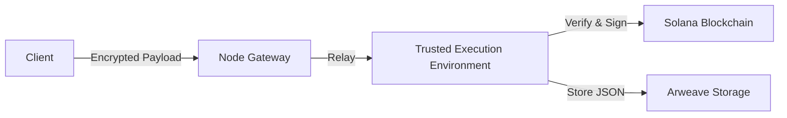

# Title Protocol

**The Identity Layer for Digital Content**

Title Protocol is a decentralized infrastructure that provides **Attribution** for digital content. By combining with **C2PA** (Coalition for Content Provenance and Authenticity), it grants digital content a complete, verifiable identity.

## 0. The Missing Piece in Digital Identity

For digital content to have a true "Identity," three conditions must be met:

1. **Provenance:** The origin and creation process are cryptographically verifiable.
2. **Integrity:** It is possible to detect if the content has been tampered with.
3. **Attribution:** The rights ownership can be resolved trustlessly.

**C2PA** solves Provenance and Integrity. **Title Protocol** solves Attribution.

### The Web Infrastructure Analogy

The relationship between C2PA and Title Protocol is analogous to the infrastructure that secures the Web:

| Role | Web Infrastructure (TLS/DNS) | Digital Content (C2PA/Title) |
| --- | --- | --- |
| **Certificate** | **SSL/TLS Certificate**<br>

<br>Proves the server is who it claims to be. | **C2PA Manifest**<br>

<br>Proves the content's origin and integrity. |
| **Audit Log** | **Certificate Transparency (CT) Logs**<br>

<br>Publicly records issuance to prevent fraud. | **Title Protocol (Core)**<br>

<br>Records TEE-verified facts to a blockchain ledger. |
| **Resolution** | **DNS**<br>

<br>Resolves a domain name to an IP address. | **Title Protocol (Resolve)**<br>

<br>Resolves a content ID to a Wallet Address. |

Just as the Web relies on DNS and CT Logs, digital content requires an infrastructure to resolve rights and audit existence. Title Protocol is that infrastructure.

## 1. Design Principles

Title Protocol is designed as a neutral, permissionless public utility.

* **Content-Agnostic & Neutral:**
The protocol operates as neutral infrastructure, much like TCP/IP. It acts as a **registry, not a regulator**. It does not judge, filter, or censor content based on its nature. If the cryptographic proofs are valid, the protocol records the attribution without bias.
* **Stateless:**
The protocol runs inside **TEEs (Trusted Execution Environments)**. These nodes hold no state between requests; they simply accept input, perform computation, and return a result.
* **Permissionless:**
Anyone can build applications on top of the protocol. Node operation is managed by a DAO, preventing dependence on any single centralized entity.
* **Privacy-First (E2EE):**
Data sent to the protocol is End-to-End Encrypted. Even the node operator cannot view the raw content, ensuring privacy and minimizing liability for operators.

## 2. Protocol Architecture

The protocol consists of two distinct layers that share a common registration and verification flow.

### Layer 1: Core (The Provenance Graph)

The Core layer establishes the **Rights Structure** of the content.

* **Input:** C2PA-signed content.
* **Process:** The TEE verifies the C2PA signature chain and recursively extracts "ingredient" data (assets used to create the content).
* **Output:** A **Provenance DAG (Directed Acyclic Graph)** recorded as a **Solana cNFT**.
* **Function:** It answers the question: *"Who is involved in this content?"* (e.g., identifying the wallet addresses of the creator and all ingredient owners for revenue distribution).

### Layer 2: Extension (The Attribute Layer)

The Extension layer attaches **Objective Attributes** to the content.

* **Input:** Content + Optional auxiliary inputs (e.g., ZK proofs).
* **Process:** The TEE executes deterministic **WASM modules**.
* **Output:** Key-Value attributes recorded as a **Solana cNFT**.
* **Function:** It answers the question: *"What are the properties of this content?"*
* *Example:* `phash-v1` calculates a perceptual hash for similarity search.
* *Example:* `ai-training-v1` extracts "Do Not Train" flags from metadata.
* *Example:* `hardware-proof` verifies if the content was captured by specific hardware (e.g., Sony, Canon, Google Pixel).


## 3. How It Works (Node Perspective)

The registration process is designed to be secure, scalable, and operator-friendly.


```mermaid
graph LR
    User[Client] -->|Encrypted Payload| Gateway[Node Gateway]
    Gateway -->|Relay| TEE[Trusted Execution Environment]
    TEE -->|Verify & Sign| Solana[Solana Blockchain]
    TEE -->|Store JSON| Arweave[Arweave Storage]

```

1. **Encryption:** The client encrypts the content and the destination wallet address using the TEE's public key (E2EE).
2. **Blind Processing:** The Node Operator (Gateway) relays the encrypted payload to the TEE. The operator **cannot** see the content or the wallet address.
3. **Verification:** The TEE decrypts the payload in a secure environment, verifies the C2PA signatures, and executes WASM modules.
4. **Signing:** The TEE signs the result with its private key.
5. **Minting:** The result is stored on Arweave, and a **Compressed NFT (cNFT)** is minted on Solana, linking the content hash to the user's wallet.

## 4. Operational Model

### Registry, Not Police

Title Protocol serves as a "Deed Office." It records objective facts (who claimed this content at what time with what proof). It does not police the content. Logic for filtering illegal content or handling disputes belongs to the **Application Layer**, not the Protocol Layer.

### Trusted Execution Environments (TEE)

Nodes must run on hardware that supports Remote Attestation (e.g., AWS Nitro Enclaves). This guarantees to the network that the node is running the exact, unmodified open-source code of the protocol, ensuring that the verification results are trustworthy without needing to trust the node operator.

### Scalability via Solana cNFTs

By utilizing Solana's Compressed NFTs (Bubblegum), the protocol can handle millions of registrations at a fraction of the cost of traditional NFTs, making it viable for high-volume content ecosystems like social media or AI generation.

## 5. Technical Stack

* **Core Logic:** Rust
* **TEE Runtime:** Abstracted via `TeeRuntime` trait (reference implementation: AWS Nitro Enclaves)
* **Temporary Storage:** Abstracted via `TempStorage` trait (reference implementation: S3-compatible)
* **Blockchain:** Solana (Compressed NFTs)
* **Off-chain Storage:** Arweave (via Irys)
* **Standards:** C2PA (Coalition for Content Provenance and Authenticity)

## 6. Vendor Separation

The protocol core is **vendor-neutral**. All vendor-specific code is isolated behind Cargo feature flags and can be cleanly excluded.

### Protocol Core (vendor-neutral)

| Component | Path | Description |
|-----------|------|-------------|
| Type definitions | `crates/types/` | Shared data structures |
| Cryptography | `crates/crypto/` | ECDH, HKDF, AES-GCM, Ed25519, attestation verification |
| C2PA verification | `crates/core/` | Provenance graph construction |
| WASM host | `crates/wasm-host/` | Deterministic extension execution (wasmtime) |
| TEE server | `crates/tee/` | Endpoint logic, mock runtime |
| Gateway server | `crates/gateway/` | HTTP API, `TempStorage` trait |
| Proxy | `crates/proxy/` | HTTP proxy (TCP fallback) |
| WASM modules | `wasm/` | phash, hardware-proof, training, license |
| Solana program | `programs/title-config/` | On-chain Global Config |
| TypeScript SDK | `sdk/ts/` | Client library |
| Indexer | `indexer/` | cNFT event indexer |

### Vendor Implementation: AWS (`vendor-aws` feature)

| Component | Path | What it adds |
|-----------|------|-------------|
| Nitro TEE runtime | `crates/tee/src/runtime/nitro.rs` | `TeeRuntime` impl using NSM API |
| Nitro attestation | `crates/crypto/src/attestation/nitro.rs` | AWS attestation document verification |
| S3 storage | `crates/gateway/src/storage/s3.rs` | `TempStorage` impl using S3-compatible API |
| vsock transport | `crates/proxy/` | vsock listener (Linux/Nitro only) |
| Deployment | `deploy/aws/` | Terraform, Docker, setup scripts |
| Docker images | `docker/` | Container images (debian-based) |

### Building without vendor features

```bash
# Protocol core only (no AWS dependencies)
cargo check --workspace --no-default-features

# With AWS vendor implementation (default)
cargo check --workspace
```

To create a vendor-neutral distribution, exclude: `deploy/`, `docker/`, and build with `--no-default-features`. The `TeeRuntime` and `TempStorage` traits provide the extension points for alternative vendor implementations.

---

## Quick Start

```bash
# Build and test the Rust workspace
cargo check --workspace
cargo test --workspace

# Build WASM modules
for dir in wasm/*/; do
  cargo build --manifest-path "${dir}Cargo.toml" --target wasm32-unknown-unknown --release
done

# Build TypeScript SDK & Indexer
cd sdk/ts && npm ci && npm run build && cd ../..
cd indexer && npm ci && npm run build && cd ..
```

## Repository Structure

```
crates/
  types/          — Shared type definitions
  crypto/         — Cryptographic primitives: ECDH, HKDF, AES-GCM, Ed25519
  core/           — C2PA verification & provenance graph construction
  wasm-host/      — WASM execution engine using wasmtime
  tee/            — TEE server: /verify, /sign, /create-tree
  gateway/        — Gateway HTTP server: upload-url, relay, sign-and-mint
  proxy/          — HTTP proxy for TEE network isolation
wasm/             — WASM modules: phash-v1, hardware-google, c2pa-training-v1, c2pa-license-v1
programs/
  title-config/   — Anchor Solana program for Global Config PDA
sdk/ts/           — TypeScript client SDK: register, crypto (E2EE), storage
indexer/          — TypeScript cNFT indexer: webhook, poller, DAS API
docker/           — Container images (Gateway, TEE, Proxy, Indexer)
deploy/           — Vendor-specific deployment (e.g., deploy/aws/ for Nitro Enclaves)
scripts/          — Operational scripts: Devnet initialization, content registration
integration-tests/ — Integration tests and stress tests (not published)
docs/             — Versioned development documentation
```

## Running a Node

Running a Title Protocol node requires a TEE-backed deployment pipeline. You can either:

1. **Use an existing deployment example** — see [deploy/aws/](deploy/aws/) for the AWS Nitro reference implementation.
2. **Create your own pipeline** — implement the `TeeRuntime` and `TempStorage` traits for your TEE platform, and create a `deploy/<vendor>/` directory following the same pattern.

The only requirement is that the deployment pipeline is **open-source and reproducible** — anyone must be able to verify that a given TEE node runs the same code. As long as this is provable, any TEE platform is valid for the protocol.

See `.env.example` for configuration options.

## For Developers

This project uses an AI-driven development workflow:

- **`CLAUDE.md`** — Instructions for AI coding assistants (project conventions, architecture)
- **`docs/`** — Versioned documentation: each version contains SPECS (what to build) → COVERAGE (what's built) → tasks (how to build it + notes)
- **`docs/v1/`** — Initial implementation phase (2026-02-21, all tasks complete)

## Contributing

See [CONTRIBUTING.md](CONTRIBUTING.md) for development setup, coding standards, and pull request guidelines.

## Security

To report a vulnerability, see [SECURITY.md](SECURITY.md).

## License

Apache-2.0 — see [LICENSE](LICENSE) for details.